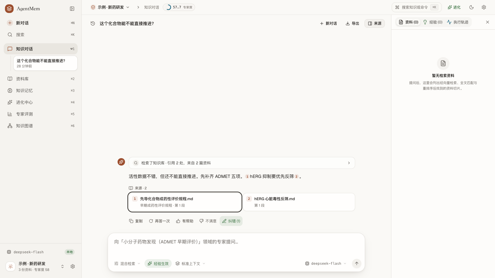
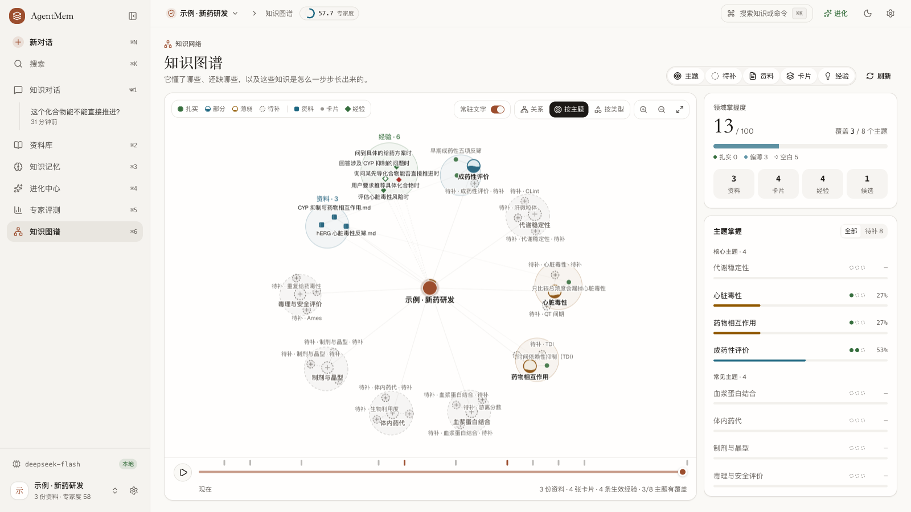
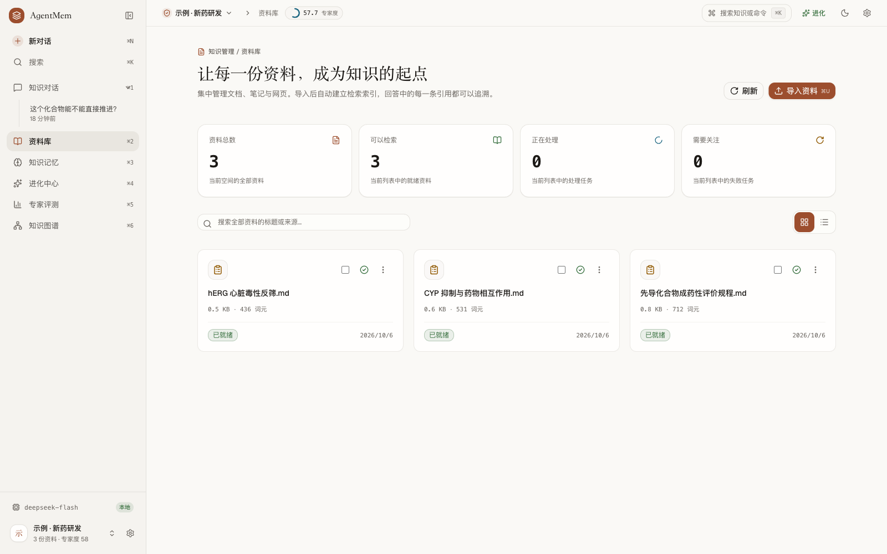
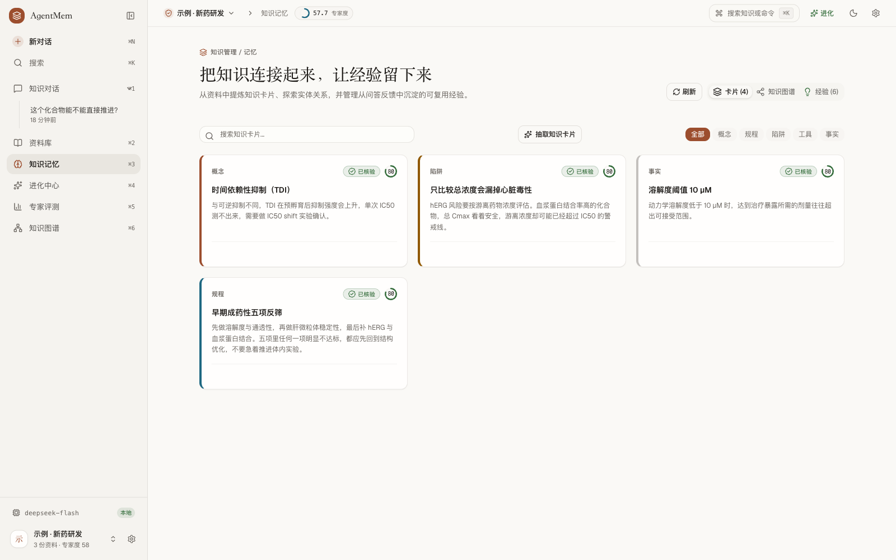
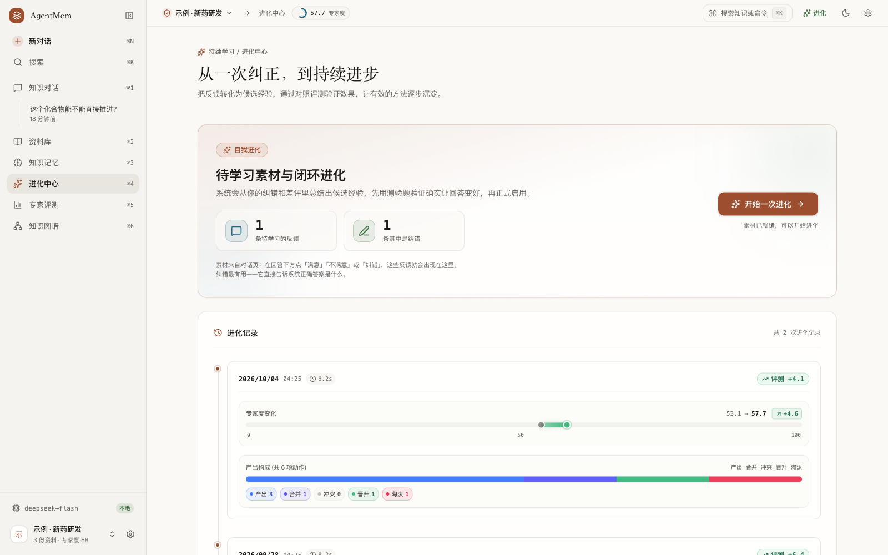
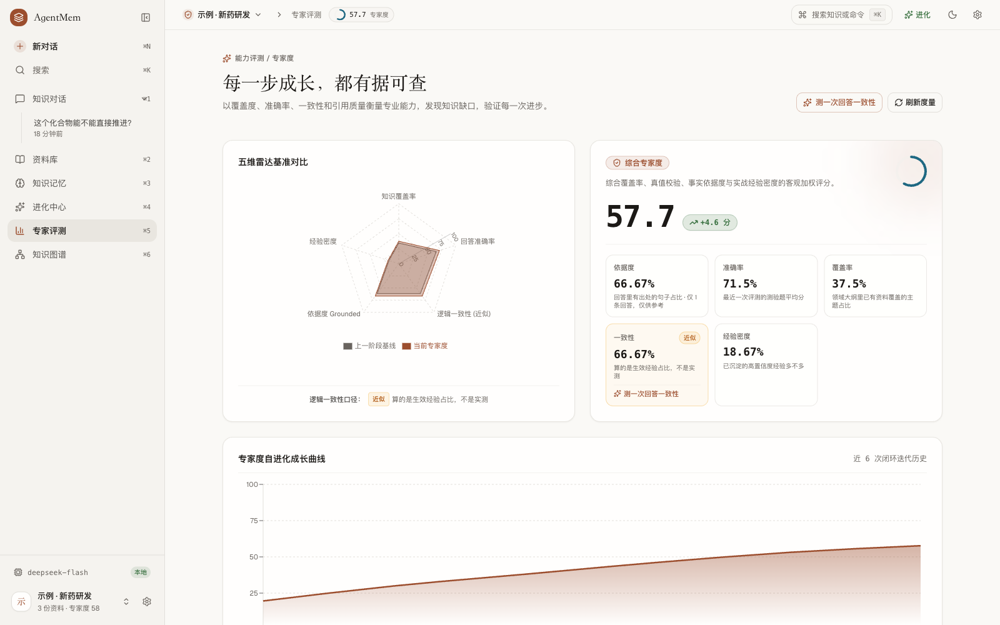
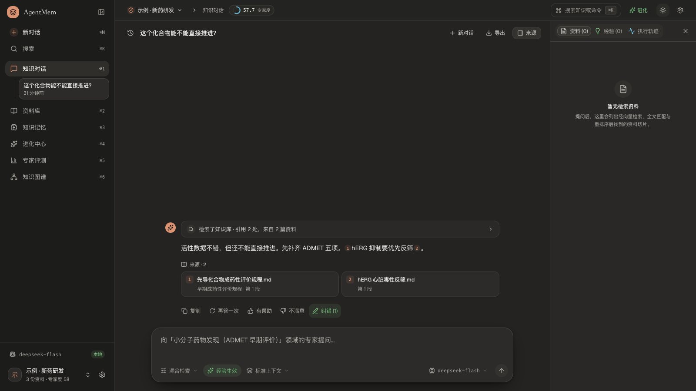
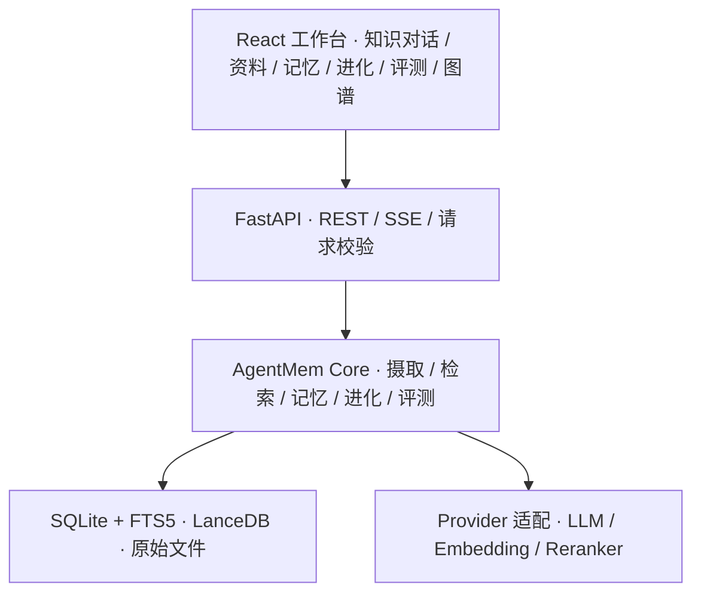
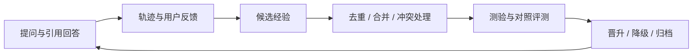

<div align="center">


# AgentMem

### 让企业知识形成记忆，让每一次反馈成为可验证的改进

面向研发、技术文档与专业知识场景的本地优先 AI 知识工作台。<br />
知识分层 · 引用溯源 · 经验沉淀 · 对照评测 · 成长图谱

[](https://github.com/sheep-programmer/AgentMemDesktop/actions/workflows/ci.yml)
[](LICENSE)
[](pyproject.toml)
[](apps/web/package.json)
[](#部署与数据边界)

[产品能力](#产品能力) · [界面导览](#界面导览) · [快速开始](#快速开始) · [系统架构](#系统架构) · [开发与贡献](#开发与贡献)

</div>



<p align="center"><sub>当前版本的真实界面，截图使用仓库内置演示数据。评测分数用于展示工作流。</sub></p>

## 项目简介

AgentMem 将资料、知识和经验组织成一个可持续维护的领域知识体系。用户导入文档后，系统建立切片与索引，抽取可编辑的知识卡片，在回答中关联原文依据，并将纠错与反馈记录为后续学习素材。

经验以候选条目的形式进入评测流程，通过对照评测决定晋升、降级或归档。团队能够检查一次回答用了哪些资料、某条经验来自什么反馈，以及一次进化产生了怎样的变化，让知识积累和质量改进都有可检查的记录。

当前实现采用单机、单用户、本地优先架构，适合领域专家、企业内部知识验证、研发文档管理和专业知识工作台原型。界面由本地 Web 应用提供；原生桌面封装列入后续路线图。

## 产品能力

| 能力 | 已实现的工作流 | 对知识工作的价值 |
| --- | --- | --- |
| 资料摄取 | 文件、网页链接与粘贴文本导入；解析、切片、向量化、进度、失败重试 | 将分散的资料转为可检索、可追溯的知识来源 |
| 知识分层 | 原始资料 → 语义切片 → 知识卡片 → 经验条目 → 专家画像 | 分开维护事实、证据、方法与输出标准 |
| 引用溯源 | 流式回答、引用编号、来源切片、原文阅读与依据句定位 | 让使用者能回到证据判断回答是否成立 |
| 知识卡片 | 概念、事实、规程、陷阱、工具分类；人工校订与版本记录 | 将资料中的知识整理成可复用的条目 |
| 反馈与进化 | 纠错素材、候选经验、合并去重、冲突裁决与评测晋升 | 把使用中发现的问题转成可验证的改进 |
| 专家评测 | 测验集、对照评测、检索配置对比、五维指标与成长曲线 | 为不同知识和检索配置提供比较依据 |
| 成长图谱 | 资料、主题、卡片、经验之间的关联；时间回放；缺口补充 | 看见知识从无到有的过程，发现待完善的主题 |
| 模型接入 | LLM、Embedding、Reranker 独立配置；角色绑定与降级链 | 根据数据边界和资源条件组合本地或云端模型 |
| 空间隔离 | 独立的资料、索引、卡片、经验、轨迹与领域设置 | 为不同项目维护各自的知识生命周期 |
| 运维与恢复 | 空间导入导出、数据体检、重建索引、请求 ID、用量记录 | 为诊断、迁移和维护提供可操作的入口 |

### 知识图谱：从目标骨架到知识积累

领域大纲先定义应当覆盖的主题，资料和卡片随着实际创建时间逐步出现，经验再与来源关联。灰色虚线节点表示未覆盖的主题或待补知识槽位，可直接补充卡片，也可以导入相关资料。

图谱支持关系、按主题、按卡片类型三种布局。文字默认隐藏，鼠标悬停时显示；右上角的“常驻文字”开关可持续显示名称。成长时间轴支持播放、暂停和拖动，刷新时沿用已有节点的位置。



<p align="center"><sub>图中开启了“常驻文字”便于展示分类；正常使用时默认仅悬停显示。</sub></p>

主题掌握度综合卡片数量与置信度；图谱覆盖与专家评测分数采用不同口径。它们帮助定位知识薄弱处，测验结果与来源证据仍应结合具体任务判断。

## 界面导览

<table>
  <tr>
    <td width="50%">资料库<br /><br /><sub>集中管理知识来源与处理状态。</sub></td>
    <td width="50%">知识记忆<br /><br /><sub>维护结构化知识与可复用经验。</sub></td>
  </tr>
  <tr>
    <td>进化中心<br /><br /><sub>从反馈到候选经验，再通过评测验证。</sub></td>
    <td>专家评测<br /><br /><sub>跟踪评测结果、覆盖与成长变化。</sub></td>
  </tr>
</table>

<details>
<summary>查看深色主题</summary>



界面支持浅色、深色与跟随系统；窄屏使用抽屉和响应式布局，动画响应系统的减弱动态效果设置。

</details>

## 适用场景

| 场景 | 典型资料 | 可沉淀的知识 |
| --- | --- | --- |
| 研发与工程 | 技术手册、架构文档、实验记录、问题复盘 | 术语、参数、操作规程、已验证的排查经验 |
| 设备运维 | 巡检规范、维护手册、故障案例 | 作业步骤、告警说明、来源明确的处理记录 |
| 技术支持 | 产品文档、常见问题、支持记录 | 可追溯的解答、已核验的边界条件 |
| 研究与知识管理 | 论文、项目笔记、参考资料 | 研究方法、概念关系与后续需要补充的主题 |

为每个领域建立独立 Space，先整理可靠资料，再逐步补充知识卡片、测验题和经验。模型与评测配置可以按空间调整。

## 快速开始

### 环境准备

- Python 3.11+ 与 [uv](https://docs.astral.sh/uv/getting-started/installation/)。
- Node.js 22.13+ 与 [pnpm 12](https://pnpm.io/installation)；仓库固定使用 `pnpm@12.4.2`。
- 运行真实问答与语义检索前，配置可用的 LLM 和 Embedding；Reranker 可按需启用。

### 1. 获取项目并安装依赖

```bash
git clone https://github.com/sheep-programmer/AgentMemDesktop.git
cd AgentMemDesktop

uv sync --frozen
cp .env.example .env

cd apps/web
pnpm install --frozen-lockfile
cd ../..
```

Windows 可在资源管理器或 PowerShell 中复制 `.env.example` 为 `.env`。

### 2. 启动本地工作台

终端一，启动 API：

```bash
uv run agentmem serve --reload
```

终端二，启动前端：

```bash
cd apps/web
pnpm dev
```

打开 `http://localhost:5173`。开发服务将 `/api` 代理到本机 `8765` 端口；API 文档位于 `http://127.0.0.1:8765/docs`。

### 3. 使用内置演示数据

```bash
uv run agentmem demo
```

该命令创建演示空间，包含文档、知识卡片、经验、反馈、测验和成长记录。演示内容预先定义，无需生成模型；已有可用 Embedding 时会尝试补充向量索引。

### 4. 配置模型

在“系统设置 → 模型”中添加 Provider，并绑定以下角色：

| 角色 | 用途 |
| --- | --- |
| `chat` | 生成回答 |
| `fast` | 轻量辅助任务与检索准备 |
| `distill` | 从反馈中蒸馏候选经验 |
| `judge` | 评测与质量判断 |
| `embedding` | 文本向量化与语义检索 |
| `rerank` | 检索候选重排序 |

公开默认配置使用 Ollama 与本地 sentence-transformers。采用本地模型时：

```bash
uv sync --extra local
ollama pull qwen3:14b
```

本地向量与重排模型在首次使用时下载权重，完成后可使用已缓存模型。也可通过设置页扫描本机 Ollama / LM Studio，选择已安装的模型。

接入云端时，将对应条目加入 Provider 配置；[模型配置模板](config/models.example.yaml) 提供 OpenAI 兼容、Anthropic 与重排服务的写法。真实密钥放入 `.env`，配置使用 `${ENV_VAR}` 占位符。

建议复制公开默认配置到 `config/models.local.yaml`，并在 `.env` 中设置：

```dotenv
AGENTMEM_MODELS_CONFIG=./config/models.local.yaml
```

这样本机 Provider 设置与公开示例分开维护。

### 5. 开始构建领域知识

1. 创建 Space，定义领域与专家画像。
2. 导入可靠资料，检查摄取状态与知识卡片。
3. 提问并打开引用来源，核对回答依据。
4. 记录满意、不满意或纠错反馈。
5. 在进化中心蒸馏经验，使用测验集与对照评测判断效果。
6. 在知识图谱与专家评测中检查覆盖，补充缺失知识。

## 系统架构

前端、HTTP 适配与领域逻辑分别维护，模型能力通过统一 Provider 接口接入。



### 五层知识与记忆

| 层级 | 内容 | 维护方式 |
| --- | --- | --- |
| L0 · Corpus | 原始文档、网页与资料 | 来源与原始文件管理 |
| L1 · Chunks | 切片、索引、向量与定位信息 | 摄取与索引重建 |
| L2 · Knowledge | 概念、事实、规程、陷阱与工具卡片 | 模型抽取、人工编辑、版本记录 |
| L3 · Insights | 经验条目、触发条件、指导与置信度 | 反馈蒸馏、评测、冲突处理与归档 |
| L4 · Persona | 领域术语、输出风格与质量标准 | 空间配置与专家画像 |

### 可验证的经验闭环



进化通过更新知识、经验和上下文进行。候选经验是否进入生效池，由配置、评测和冲突处理结果共同决定。

### 技术栈与目录

| 层 | 主要技术 |
| --- | --- |
| API 与领域逻辑 | Python、FastAPI、Pydantic、asyncio、SSE |
| 数据与检索 | SQLite / WAL / FTS5、LanceDB、混合检索、RRF、重排 |
| 文档解析 | Docling、MarkItDown |
| 工作台 | React 19、TypeScript、Vite、Tailwind CSS、Base UI、Zustand、TanStack Query |
| 可视化 | Recharts、react-force-graph-2d、Mermaid |
| 验证 | pytest、Ruff、mypy、Vitest、Testing Library、Playwright |

```text
apps/api/                HTTP 路由、事件流与静态页面托管
apps/web/                前端工作台与交互组件
packages/core/agentmem/  领域逻辑、Provider、检索与存储
config/                  模型默认配置与接入模板
tests/                   后端测试
scripts/                 诊断、端到端验证与性能测量
docs/                    架构、接口、质量记录与产品截图
data/                    本地运行时数据，默认不进入版本库
```

## 部署与数据边界

构建前端后，可由同一个本地 API 服务托管工作台：

```bash
cd apps/web
pnpm build
cd ../..

AGENTMEM_ENV=prod uv run agentmem serve
```

打开 `http://127.0.0.1:8765`。Windows 可先设置环境变量 `AGENTMEM_ENV=prod` 再启动服务。

- 数据位置：默认存储在 `./data`；使用 `AGENTMEM_DATA_DIR` 指定路径。每个 Space 有独立的元数据库、向量目录与原始文件目录。
- 模型边界：知识与轨迹保存在本地，调用云端 Provider 时相关上下文会发送到所配置的服务；全部使用本地模型时可在权重准备完成后离线运行。
- 配置与密钥：密钥支持环境变量占位符，API 返回掩码；公开默认配置不包含真实访问密钥。
- 维护与迁移：设置页支持空间导出、导入与索引重建；`agentmem doctor` 和 `agentmem recover` 默认先列出诊断结果，显式 `--apply` 后执行修复。
- 当前服务范围：默认监听 `127.0.0.1`，包含本地请求来源检查。组织账户、SSO、RBAC、共享租户和高可用部署尚未实现，企业接入需按自身要求补充这些能力。

## 开发与贡献

项目通过 GitHub Actions 执行后端 Python 3.11 / 3.12 检查与前端验证。已有回归覆盖摄取并发、取消与恢复、数据一致性、引用定位、反馈闭环、流式渲染和关键界面对比度。

本次公开快照的本地验收包含 736 项后端测试、211 项前端测试，以及 166 个 Python 文件的严格类型检查、前端类型检查与构建、深浅主题的界面对比度回归。后续提交的验证结果以仓库 CI 为准。

```bash
# 项目根目录
uv run ruff check .
uv run ruff format --check .
uv run mypy
uv run pytest -q

# apps/web
pnpm typecheck
pnpm lint
pnpm test:run
pnpm build
```

参与方式与完整检查步骤见 [CONTRIBUTING.md](CONTRIBUTING.md)。欢迎通过 [Issues](https://github.com/sheep-programmer/AgentMemDesktop/issues) 提交问题和建议，通过 Pull Request 贡献改进。

## 文档索引

| 文档 | 内容 |
| --- | --- |
| [产品愿景](docs/00-VISION.md) | 五层记忆、经验闭环与目标场景 |
| [系统架构](docs/01-ARCHITECTURE.md) | 分层、存储与模型适配设计 |
| [数据模型](docs/02-DATA-MODEL.md) | 数据实体与表结构 |
| [API 规范](docs/03-API-SPEC.md) | 接口与 SSE 协议 |
| [前端规范](docs/04-FRONTEND-SPEC.md) | 页面、设计系统与交互 |
| [质量基线](docs/07-QUALITY-BASELINE.md) | 改进范围、验证与工程边界 |
| [性能报告](docs/08-PERFORMANCE-REPORT.md) | 测量方法、结果与适用范围 |
| [数据一致性](docs/09-DATA-CONSISTENCY.md) | 摄取、维护与并发保护 |
| [长任务](docs/10-LONG-TASKS.md) | 取消、断流和异常恢复 |
| [上下文效率](docs/11-TOKEN-EFFICIENCY.md) | 上下文策略与测量记录 |
| [路线图](docs/05-ROADMAP.md) | 后续计划与实施阶段 |

## 许可证

AgentMem 自研代码采用 [MIT License](LICENSE)。第三方依赖、模型权重与外部资料分别遵循各自的许可证和使用条件。
