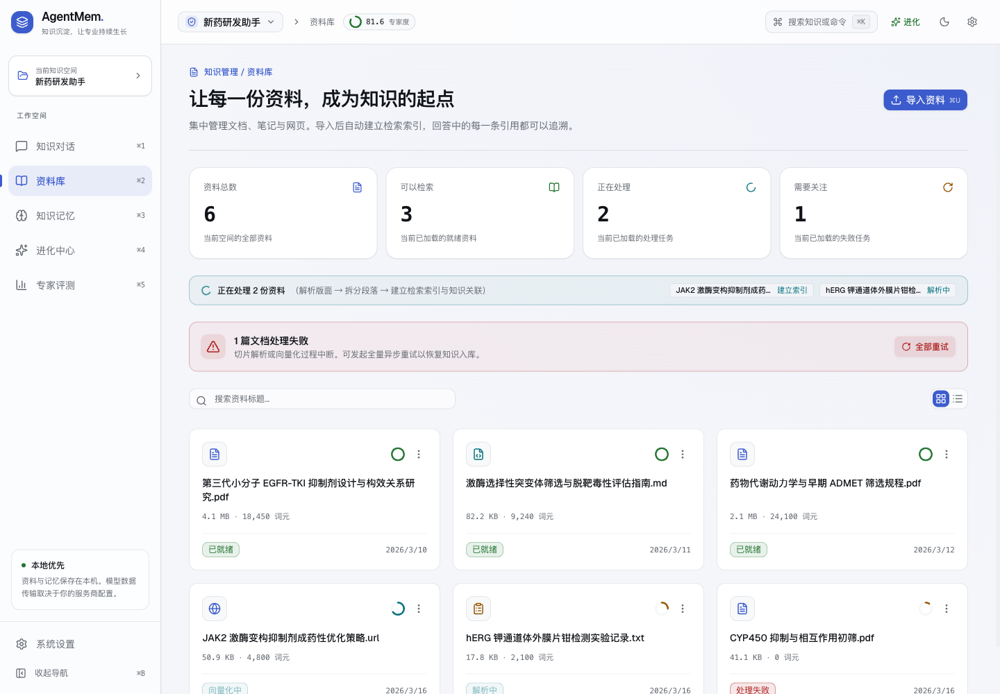
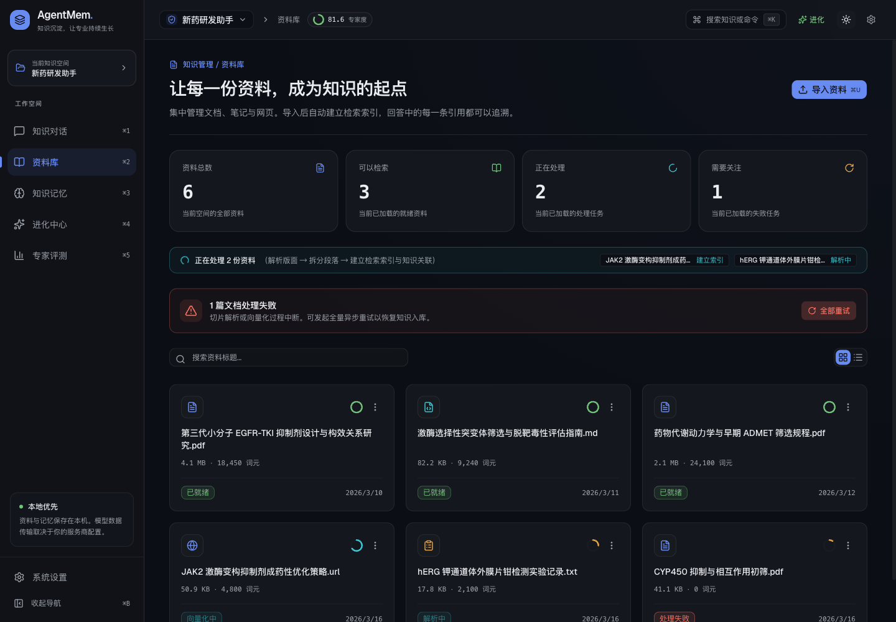

# 工程质量与界面升级记录

验收日期：2026-10-02。基于工作区已有实现继续改进，未覆盖已有功能与模型配置。

## 交付范围

本轮按项目的「本地优先、单机运行」定位提升工程质量与体验。企业多用户服务所需的组织权限、SSO、集中审计与高可用部署不在当前实现内；测试通过也不等于已完成这些能力或独立安全审计。

## 稳定性与可诊断性

- SQLite 查询、事务与 FTS 工作线程在收到协程取消后先完成当前操作，再释放连接锁。连接关闭同样等待在途操作，避免后台线程访问已释放连接而导致进程崩溃。
- 取消发生在事务 BEGIN 阶段时也会回滚；并发 connect 只建立一个连接。
- 生产环境直接打开或刷新 `/settings`、`/s/:id/library` 等地址能返回应用页面。缺失的 API、脚本、PDF 资源仍返回真实的 404。
- 每个 HTTP 请求生成 `X-Request-ID`，日志关联同一 ID。`response_start_ms` 记录响应头开始返回的等待时间，流式请求的总生成时间仍以轨迹指标为准。
- 普通 JSON GET / HEAD 默认 30 秒超时；长耗时的模型写操作保留原有等待行为，可按调用设置 `timeoutMs`。调用方取消保留原始取消原因，写请求不会自动重试。
- API 错误保留状态码、业务错误码、错误详情与请求 ID；网络中断、无效响应和超时分别返回可理解的提示。
- 启动时的知识空间请求合并，恢复上次仍有效的选择；刷新失败保留已有数据。空间验证完成后才挂载其业务页面。
- 系统主题默认跟随操作系统，手动设置优先；本地存储不可用或保存值损坏时仍可启动与切换。
- 页面异常与旧版本资源加载失败提供恢复入口。

## UI 与操作体验

- 统一工作台导航、页面标题、间距、卡片、Geist 字体和深浅主题；首次打开默认展开导航，小窗口保留图标导航。
- 资料库增加四项状态概览。总数来自接口，其余状态数字明确标注当前已加载的资料，避免将分页数据冒充全库统计。
- 修复资料库超出容器高度造成的裁切，表格可在容器内横向滚动；搜索无结果时可直接清除筛选。
- 聊天窗口根据可用宽度展示历史面板与引用面板，窄屏改用可关闭抽屉；新对话按钮、快捷键和命令搜索使用一致的行为。
- 资料卡片与历史会话提供键盘可用的打开按钮，聊天输入兼容中文输入法；补充主要图标按钮的可访问名称与跳转内容入口。
- 设置标签可在窄屏横向滚动，摄取队列换行并显示中文阶段名称。
- CSS 动画响应 `prefers-reduced-motion`；toast 跟随当前主题。

## 第二轮：分页搜索与异步操作

- 资料库与历史会话改为服务端搜索，覆盖首屏之外的数据。搜索带 250ms 防抖，后续分页保留关键词，列表按 ID 去重。
- 列表缓存按空间与关键词隔离，旧请求会取消；旧响应不能覆盖新搜索。刷新失败保留上次成功数据并提供重试，空搜索结果不会冒充空知识空间。
- 资料库总数单独查询，搜索结果不会改变全库总数。增加刷新入口；改变筛选时清空选择，批量删除使用选中快照并阻止重复提交，失败资料与选择继续保留。
- 新建会话期间只接受一次发送。加载历史、切换会话、停止回答、卸载页面均隔离旧的消息、进度、轨迹和错误回调；旧停止请求不会终止新回答。
- 流连接没有收到完成事件便结束时，保留已生成内容并标记「回答未完成」。演示流取消后清理计时器。
- 「全部重试」读取全部失败资料分页，完成数量以后端确认的 `retried` 为准；重复错误只记一次，部分 / 全部失败使用警告 / 错误提示。
- 记忆与评测页面在数据刷新失败或不完整时不再显示成功提示；当前评分加载失败时不展示初始 0 分，一致性测算成功但刷新评分失败时分别说明结果。
- 演示接口支持实际分页与排序，使浏览器验收能覆盖超过 50 条记录的行为。会话搜索 API 与生成类型同步更新，`%`、`_` 和反斜杠按字面关键词匹配。

本轮浏览器使用临时示例数据：81 篇资料 / 78 条会话，验证首屏 50 条、首屏外目标搜索、搜索分页、总数保留、窄屏选择和空结果。201 篇失败资料的全量重试由后端集成测试验证。

## 第三轮：命令面板与细节一致性

- 命令面板打开时重置旧的搜索上下文；知识搜索有短防抖，切换关键词或关闭面板会取消在途请求，旧响应不能覆盖当前结果。
- 搜索面板保留明确的加载、空结果与请求失败状态，检索模式下拉按钮、资料选择框和资料操作菜单补齐可访问名称。
- 保留大型 Mermaid、PDF、语法高亮资源为真实按需 chunk；构建警告继续显示，避免通过调高阈值掩盖下载体积。

## 深度优化：任务调度、流传输与按需查询

- 复现并修复慢客户端的聊天事件丢失：结束状态与数据队列分开处理，保留背压并排空全部帧；生产者异常通过 SSE 错误帧明确传递。
- 同会话新请求替换旧请求时先等待旧请求清理；删除会话、删除空间及运行时退出前等待生成任务停止与落库，避免继续写入已关闭的库。
- 摄取队列统计按空间分别计算实际运行与排队数；取消排队任务或任务未开始就取消时关闭协程并移除登记。取消超时保留登记且拒绝继续删除，避免静默丢失仍在清理的任务。
- 批量摄取改为滑动窗口：只创建并发上限数量的文档任务。10,000 篇、并发 3 的模拟对照中，在途任务 10,000 → 3，Python 调度峰值分配约 15.2 MB → 8.2 KB。完整数据及边界见 [性能报告](08-PERFORMANCE-REPORT.md)。
- 向量库沿用取消安全的工作线程策略，读写 / 关闭互斥；建表验证与写入在同一锁内完成，避免中间被关闭或删表。
- 前端 SSE 采用增量逐行解析，支持 LF / CRLF / CR 与 UTF-8 跨包、保留原始空白、多行 data、忽略心跳并限制未完成帧大小；异常 / 取消时释放 reader。关闭心跳不再忙循环。
- 常驻 GET 进度订阅在断线后以 1–30 秒退避重连，POST 操作不重放；永久 4xx 不自动重连。回调身份变化不再重建连接，旧连接不影响新连接的状态。
- 命令面板补齐 cmdk 容器与可访问标题，语义搜索真正防抖并可取消；命中直接打开文档 / 原文切片，只有当前选中项显示高亮。搜索失败与无结果分别显示，演示搜索限定当前空间。
- 图谱渲染、测验管理、对比弹层独立按需加载，图谱数据也仅在打开图谱标签时请求。记忆页 JS 248.26 KB → 92.78 KB，专家页 125.10 KB → 72.79 KB；这些是入口模块差异，不是全应用体积减少。

浏览器验收确认命令搜索打开真实示例来源、图谱与评测模块按标签加载、对比面板按打开加载，以及窄屏命令面板边界；命令面板已加入深浅主题对比度与选中态回归，并修复检查脚本中设置页的路由；图谱画布改为按实际容器尺寸响应窗口变化。

## 摄取与维护并发一致性

- 文档锁从单个流水线移到共享数据层，不同 HTTP 请求创建的流水线会共同串行处理同一文档。锁使用弱引用，文档处理结束后不会永久积累锁对象。
- 空间维护采用带所有权的互斥许可：重复维护拒绝；摄取、登记、聊天、排队文档与手动抽取持有写入 / 文档预约，未完成时不能清空索引。重建和重试流水线使用本次维护许可，其他请求不能借用该许可。
- 排队前就预约文档，重复重新解析不会再入队；任务未开始就取消也释放预约。文档删除与导出覆盖整个维护过程，避免先检查、随后并发写入的时间窗口。
- 并发重复登记由 SQLite 唯一约束确认并返回 `DUPLICATE_DOCUMENT`，不再成为内部错误。上传原文每个请求使用独立路径，失败请求只清理自己的副本，避免删除成功请求的原文。
- 处理取消后立即标记可重试失败并推进度；切片版本仅在切片创建成功后写入。增量重建也选择失败 / 中断文档，即使切片版本已是当前版，也会补齐未完成向量化。
- 这些保护作用于同一应用进程内的相关操作；没有改变单机架构或增加跨进程分布式锁。

本轮新增 10 项回归、全量 665 项后端测试通过。流程范围及行为对照见 [数据一致性记录](09-DATA-CONSISTENCY.md)。

## 长任务取消与恢复

- 进化、评测、生成考题与一致性测算使用共享操作许可，执行与清理期间拒绝维护；同空间同类任务拒绝重复启动。
- 流式任务离开页面、换空间或手动停止时中止请求。旧任务的回调与结束逻辑不能覆盖新任务；有限任务流缺少完成事件时显示错误并恢复操作。
- 进化、评测、出题和配置对比加入停止按钮，错误与中断提示保留在页面并提供刷新入口。运行中的配置对比弹窗可以关闭，头部适配窄屏。
- 对比度检查加入测验题标签与对比弹窗的运行 / 停止状态，修正深色基准方案徽章对比度。备份下载稍后释放 Blob URL。

新增 5 项后端、20 项前端回归。取消不回滚已保存的业务结果；完整行为及验证边界见 [长任务记录](10-LONG-TASKS.md)。

## 上下文与 token 使用

- 标准 / 节省两套策略约束历史、卡片、经验与原文预算；节省模式可按问题摘取原文句子窗口，不新增摘要或句子嵌入调用。
- 保留最近完整问答、稳定的人格与当前问题，原始资料和历史不裁剪。结构化内容、词面信号不足与宽泛问题走回退路径；索取原文时使用标准策略。
- 实际注入清单统一用于经验展示、使用计数和引用登记，输入估算与服务商计费统计分别标明。
- 聊天新增上下文策略选择、估算摘要与菜单对比度检查，修复关闭的窄屏抽屉继续遮挡输入的问题。

五个离线合成场景中，三个长场景的节省模式减少约 63%–78% 的 `o200k_base` 正文 token；短问答和短表格保持不变。净增 24 项后端、5 项前端回归。输入量、片段保留与真实回答质量的区别见 [token 优化记录](11-TOKEN-EFFICIENCY.md)。

## 加载与构建

第一轮将命令搜索、知识空间切换、全局文档阅读器改为按需加载，入口 JavaScript 从 709.54 KB（gzip 230.31 KB）降至约 605 KB（gzip 197 KB）。本轮加入流传输韧性等公共逻辑后为 612.94 KB（gzip 200.62 KB），页面模块的按需加载对比见性能报告。这是入口包大小比较，并非整站下载量或首次显示耗时的测量。

Markdown、图表、PDF 及代码语法等资源仍按需加载。构建仍会提示部分可选资源 chunk 超过 500 KB；没有通过上调警告阈值隐藏它们。

## 第二轮收尾：确认与安全响应

- 资料、会话、服务商、知识卡片、重新抽取、评测和进化等高影响操作统一使用应用内确认对话框，跟随主题并支持键盘取消 / 确认；确认等待期间重复点击会被锁住，组件卸载或路由变化会自动取消。
- 生产 API 统一添加 `X-Request-ID`、`X-Content-Type-Options`、`X-Frame-Options`、`Referrer-Policy` 和 `Permissions-Policy`；本地 HTTP 服务不启用 HSTS，避免把开发地址锁死为 HTTPS。
- HTML 首屏在 React 启动前恢复主题，减少系统浅色用户的深色闪烁；设置页服务商类型徽章通过对比度回归。

## 更容易理解和操作的界面

聊天进度改为突出当前步骤，详细阶段按需展开；历史记录、停止和检索受限分别呈现。回答操作常驻并带文字，剪贴板失败不会报成功，纠错明确作为待学习素材。备份恢复加入错误重试、刷新列表和进入空间的下一步；用量页使用实际输入 / 输出量，移除固定折扣费用假设。范围和截图见 [界面改进记录](12-HUMAN-UI.md)。

导入表单新增标签、链接校验、逐文件失败清单与草稿重试；历史操作改为常驻菜单，资料卡片按实际处理状态展示。新增 12 项前端回归，范围与截图见 [细节改进记录](13-UI-DETAILS.md)。

## 流式渲染性能

流式 token 由原来的逐 token 触发整树重渲染，改为按 50ms 时间片合并写入；消息气泡与会话列表 memo 化，历史 Markdown 不再跟随流式重算。实测 7.1 秒回答 DOM 变更从约每字符一批降到 80 批（≈11 次/秒）。新增 2 项前端回归，测量方法与结果见 [渲染性能记录](14-RENDER-PERFORMANCE.md)。

## 引用标记渲染一致性

修复同一条回答里引用标记两种长相（灰色 [cN] 与数字芯片混排）：streamdown 分块缓存按旧引用表渲染、前端丢弃 citation 事件的 char_offset、mock 流式与生产契约不一致。新增 3 项前端回归，详见 [引用渲染记录](15-CITATION-RENDERING.md)。

## 验证记录

| 检查 | 结果 |
| --- | --- |
| Python `ruff check` / `ruff format --check` | 通过 |
| Python `mypy --strict` | 158 个源文件通过 |
| Python `pytest -q` | 694 项通过 |
| 前端 `typecheck` / `lint` | 通过 |
| 前端 `test:run` | 198 项通过 |
| 前端生产构建 | 通过 |
| 六个页面 × 深浅主题及阅读 / 导入 / 卡片 / 配置对比弹层文字对比度 | 正文 4.5:1、大字 3:1，通过 |
| 六个页面 × 390 / 900 / 1440 像素窗口 | 页面无横向溢出 |
| 窄屏历史 / 引用抽屉、关闭、新对话 | 交互通过，引用抽屉无裁切 |

新增回归覆盖数据库取消 / 关闭 / 事务 / 并发连接、生产静态托管、请求 ID、网络错误 / 超时 / 取消、启动请求合并、空间恢复和主题持久化。

浏览器交互使用前端示例数据验证，不会改动实际知识空间或调用云端模型。模型适配与 API 集成由后端测试的 mock 模型服务验证，本轮未重新评测用户配置的真实模型输出质量。

## 复核命令

```bash
uv run ruff check .
uv run ruff format --check .
uv run mypy
uv run pytest -q

cd apps/web
pnpm typecheck
pnpm lint
pnpm test:run
pnpm check:contrast
pnpm build
```

## 界面预览（第一轮样式）

截图使用示例空间数据。




